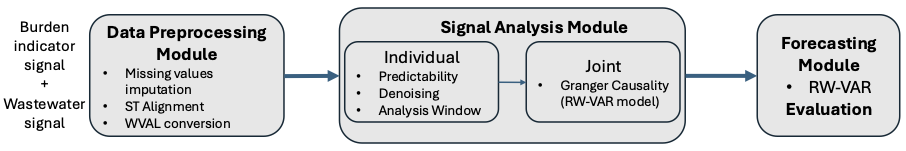

# Epiflow

EpiFlow: Epidemic Predictive Intelligence Framework Leveraging Observables from Wastewater Surveillance

The codebase contains scripts for preprocessing and extracting metrics from wastewater viral load datasets, and evaluating their utility in predicting various clinical and syndromic surveillance datasets. 



1. Data Preprocessing Module - This module primarily focuses on formatting time series data and ensuring temporal and spatial alignment across multiple datasets, facilitating accurate comparison. Key steps include data cleansing and harmonization of temporal and spatial dimensions. The necessary functions are provided in `viral_utils.py`. An example of the of the use of the functions in data preprocessing workflow is provided in
    ```
   data_preprocessing_workflow.ipynb
    ```
3. Signal Analysis Module - This module focuses on ($i$) determining the appropriate window length based on predictability, ($ii$) denoising, and ($iii$) the causal relationship between the time series. The necessary functions are provided in `viral_utils.py`. An example of the use of the functions in signal analysis workflow is provided in
   ```
   signal_analysis_workflow.ipynb
   ```
4. Forecasting module - This module generates forecasts using a VAR model and is designed to provide real-time forecasts. The rolling-window length and the number of lags are determined from the signal analysis module, and the model is retrained when new observation is obtained. The model-related functions are provided in `BVAR.py`. An example of the of the use of the functions in forecasting workflow is provided in
   ```
   forecast_workflow.ipynb
   ```

